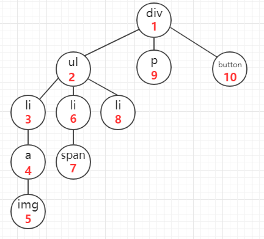
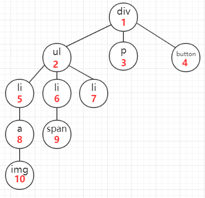

# JS算法之深度优先遍历(DFS)和广度优先遍历(BFS)

我们用遍历DOM树上的节点来说明这其中的区别，比方有以下这个DOM树：

<p align="center">
    
    <div align="center">深度优先遍历(DFS)和广度优先遍历(BFS)</div>
</p>

## 深度优先遍历（Depth-First Search）

该方法是以纵向的维度对dom树进行遍历，从一个dom节点开始，一直遍历其子节点，直到它的所有子节点都被遍历完毕之后在遍历它的兄弟节点。即如图所示（遍历顺序为红字锁标）：
<p align="center">
    
    <div align="center">深度优先遍历</div>
</p>

```js
function deepFirstSearch(node,nodeList) {  
    if (node) {    
        nodeList.push(node);    
        var children = node.children;    
        for (var i = 0; i < children.length; i++) 
        //每次递归的时候将 需要遍历的节点 和 节点所存储的数组传下去
        deepFirstSearch(children[i],nodeList);    
    }    
    return nodeList;  
} 
```

## 广度优先遍历（Breadth-First Search）

该方法是以横向的维度对dom树进行遍历，从该节点的第一个子节点开始，遍历其所有的兄弟节点，再遍历第一个节点的子节点，完成该遍历之后，暂时不深入，开始遍历其兄弟节点的子节点。即如图所示（遍历顺序为红字锁标）：
<p align="center">
    
    <div align="center">广度优先遍历</div>
</p>

```js
function breadthFirstSearch(node) {
    var nodes = [];
    var i = 0;
    var recurtion = function(node){
        if (!(node == null)) {
            nodes.push(node);
            recurtion(node.nextElementSibling);
            node = nodes[i++];
            recurtion(node.firstElementChild);
        }
    }
    recurtion(node);
    return nodes;
}

```